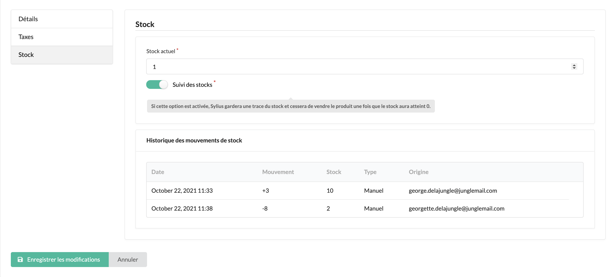

<p align="center">
  <a href="http://www.aropixel.com/">
    
  </a>
</p>

## Aropixel Sylius Stock Movement Plugin

Log and display the product stock movements. When the stock of a product is updated, the stock movement will be saved 
and displayed in the admin product stock tab. The origin of the stock update is also displayed (either a new order or a manual update).

## Installation

- Install this plugin using composer : 

```bash
composer require aropixel/sylius-stock-movement-plugin
```

- Add the StockMovement interface and trait to your ProductVariant Entity: 

```php
    ...
    
    namespace App\Entity\Product;

    ...
    
    use Aropixel\SyliusStockMovementPlugin\Entity\ProductVariantMovementInterface;
    use Aropixel\SyliusStockMovementPlugin\Entity\ProductVariantMovementTrait;
    ... 
    
    /**
     * @ORM\Entity
     * @ORM\Table(name="sylius_product_variant")
     */
    class ProductVariant extends BaseProductVariant implements ProductVariantMovementInterface
    {
        use ProductVariantMovementTrait;

    ...
```

## Screenshots



